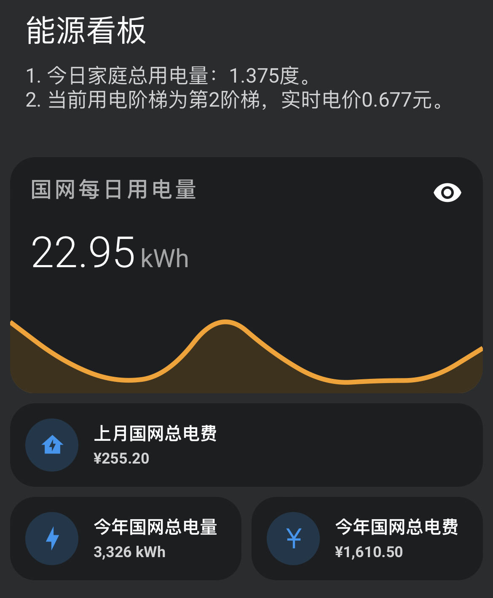
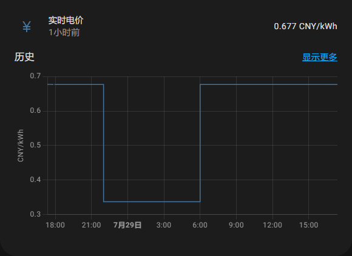
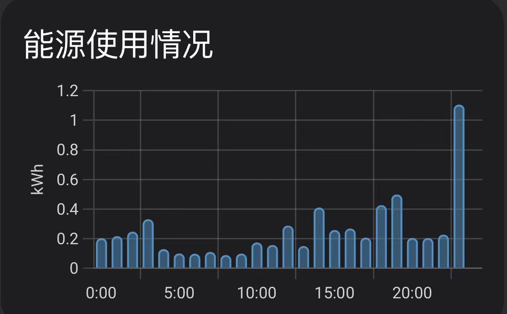

**重要说明：**原作者@renhai-lab 已于2023年10将项目归档，原仓库不再更新。这个版本是在原仓库基础上更新的。在此向原作者表达谢意和致敬。验证码识别已经从最开始的在线商业API替换成离线神经网络检测版本，请使用本仓库的同学点个小星星，或者打赏鼓励。
### 支付宝&微信 打赏码

<p align="center">


</p>

# ⚡️国家电网电力获取

[](https://github.com/ARC-MX/sgcc_electricity_new/actions/workflows/docker-image.yml)
[](https://hub.docker.com/r/arcw/sgcc_electricity)
[](https://hub.docker.com/r/arcw/sgcc_electricity)

<p align="center">


</p>

本应用可以帮助你将国网的电费、用电量数据接入homeassistant，实现实时追踪家庭用电量情况；并且可以将每日用电量保存到数据库，历史有迹可循。具体提供两类数据：

1. 在homeassistant以实体显示：

   | 实体entity_id                     | 说明                                                                  |
   | --------------------------------- | --------------------------------------------------------------------- |
   | sensor.last_electricity_usage     | 最近一天用电量，单位KWH、度。属性含present_date（查询电量代表的日期） |
   | sensor.electricity_charge_balance | 预付费显示电费余额，反之显示上月应交电费，单位元                      |
   | sensor.yearly_electricity_usage   | 今年总用电量，单位KWH、度。                                           |
   | sensor.yearly_electricity_charge  | 今年总用电费用，单位元                                                |
   | sensor.month_electricity_usage    | 最近一天用电量，单位KWH、度。属性含present_date（查询电量代表的日期） |
   | sensor.month_electricity_charge   | 上月总用电费用，单位元     属性含present_date（查询电量代表的日期）   |
2. 可选，近三十天每日用电量数据（SQLite数据库）
   数据库表名为 daily+userid ，在项目路径下有个homeassistant.db  的数据库文件就是；
   如需查询可以用

   ```
   "SELECT * FROM dailyxxxxxxxx;"
   ```

   得到如下结果：

<p align="center">

</p>
## 一、适用范围

1. 适用于除南方电网覆盖省份外的用户。即除广东、广西、云南、贵州、海南等省份的用户外，均可使用本应用获取电力、电费数据。
2. 不管是通过哪种哪种安装的homeassistant，只要可以运行python，有约1G硬盘空间和500M运行内存，都可以采用本仓库部署。

本镜像支持架构：

> - `linux/amd64`：适用于 x86-64（amd64）架构的 Linux 系统，例如windows电脑。
> - `linux/arm64`：适用于 ARMv8 架构的 Linux 系统，例如树莓派3+，N1盒子等。
> - `linux/armv7`，暂不提供 ARMv7 架构的 Linux 系统，例如树莓派2，玩客云等，主要原因是onnx-runtime没有armv7版本的库，用户可以参考 [https://github.com/nknytk/built-onnxruntime-for-raspberrypi-linux.git](https://github.com/nknytk/built-onnxruntime-for-raspberrypi-linux.git)自行安装库然后编译docker镜像。

## 二、实现流程

通过python的selenium包获取国家电网的数据，通过homeassistant的提供的[REST API](https://developers.home-assistant.io/docs/api/rest/)将采用POST请求将实体状态更新到homeassistant。

国家电网添加了滑动验证码登录验证，我这边最早采取了调用商业API的方式，现在已经更新成了离线方案。利用Yolov3神经网络识别验证码，请大家放心使用。

## 三、安装

### 1）注册国家电网账户

首先要注册国家电网账户，绑定电表，并且可以手动查询电量

注册网址：[https://www.95598.cn/osgweb/login](https://www.95598.cn/osgweb/login)

### 2）docker镜像部署，速度快

1. 安装docker和homeassistant，[Homeassistant极简安装法](https://github.com/renhaiidea/easy-homeassistant)。
2. 克隆仓库

   ```bash
   git clone https://github.com/ARC-MX/sgcc_electricity_new.git
   # 如果github网络环境不好的话可以使用国内镜像，完全同步的，个人推荐使用国内镜像
   # git clone https://gitee.com/ARC-MX/sgcc_electricity_new.git
   cd sgcc_electricity_new
   ```
3. 创建环境变量文件

   ```bash
   cp example.env .env
   vim .env
   ```

   参考以下文件编写.env文件

   ```bash
   # 以下项都需要修改
   # 国网登录信息
   PHONE_NUMBER="xxx" # 修改为自己的登录账号
   PASSWORD="xxxx" # 修改为自己的登录密码


   # SQLite 数据库配置
   # True or False 不启用数据库储存每日用电量数据。
   ENABLE_DATABASE_STORAGE=True
   # 数据库名，默认为homeassistant.db
   DB_NAME="homeassistant.db"
   # COLLECTION_NAME默认为electricity_daily_usage_{国网用户id}，不支持修改。

   # homeassistant配置
   HASS_URL="http://localhost:8123/" # 改为你的localhost为你的homeassistant地址

   HASS_TOKEN="eyxxxxx" # homeassistant的长期令牌

   # selenium运行参数
   JOB_START_TIME="07:00" # 任务开始时间，24小时制，例如"07:00”则为每天早上7点执行，第一次启动程序如果时间晚于早上7点则会立即执行一次。

   ## 其他默认参数
   DRIVER_IMPLICITY_WAIT_TIME=60 # 浏览器默认等待时间，秒。
   RETRY_TIMES_LIMIT=5 # 登录重试次数
   LOGIN_EXPECTED_TIME=60 # 登录超时时间，秒
   RETRY_WAIT_TIME_OFFSET_UNIT=10 
   FIRST_SLEEP_TIME=10 # 第一次运行等待时间，秒

   # 日志级别
   LOG_LEVEL="INFO" # 例如“DEBUG”可以查看出错情况
   ```
4. 运行

   我已经优化了镜像环境，将镜像的地址配置为阿里云，如果要使用docker hub的源可以将docker-compose.yml中
   image: registry.cn-hangzhou.aliyuncs.com/arcw/sgcc_electricity:latest 改为 arcw/sgcc_electricity:latest

   ```bash
   docker compose up --build 
   # 或者后台运行
   docker compose up -d --build
   ```
5. 更新容器

   ```bash
   docker compose down # 删除容器
   docker compose pull # 更新镜像
   docker compose up # 重新运行
   ```
6. 运行成功应该显示如下日志：

```bash
2024-06-06 16:00:43  [INFO    ] ---- 程序开始，当前仓库版本为1.x.x，仓库地址为https://github.com/ARC-MX/sgcc_electricity_new.git
2024-06-06 16:00:43  [INFO    ] ---- enable_database_storage为false，不会储存到数据库
2024-06-06 16:00:43  [INFO    ] ---- 当前登录的用户名为: xxxxxx，homeassistant地址为http://192.168.1.xx:8123/,程序将在每天00:00执行
2024-06-06 16:00:43  [INFO    ] ---- 此次为首次运行，等待时间(FIRST_SLEEP_TIME)为10秒，可在.env中设置
2024-06-06 16:00:59  [INFO    ] ---- Webdriver initialized.
2024-06-06 16:01:20  [INFO    ] ---- Click login button.
2024-06-06 16:01:20  [INFO    ] ---- Get electricity canvas image successfully.
2024-06-06 16:01:20  [INFO    ] ---- Image CaptCHA distance is xxx.
2024-06-06 16:01:25  [INFO    ] ---- Login successfully on https://www.95598.cn/osgweb/login
2024-06-06 16:01:33  [INFO    ] ---- 将获取1户数据，user_id: ['xxxxxxx']
2024-06-06 16:01:42  [INFO    ] ---- Get electricity charge balance for xxxxxxx successfully, balance is xxx CNY.
2024-06-06 16:01:51  [INFO    ] ---- Get year power usage for xxxxxxx successfully, usage is xxx kwh
2024-06-06 16:01:51  [INFO    ] ---- Get year power charge for xxxxxxx successfully, yealrly charge is xxx CNY
2024-06-06 16:01:55  [INFO    ] ---- Get month power charge for xxxxxxx successfully, 01 月 usage is xxx KWh, charge is xxx CNY.
2024-06-06 16:01:55  [INFO    ] ---- Get month power charge for xxxxxxx successfully, 02 月 usage is xxx KWh, charge is xxx CNY.
2024-06-06 16:01:55  [INFO    ] ---- Get month power charge for xxxxxxx successfully, 2024-03-01-2024-03-31 usage is xxx KWh, charge is xxx CNY.
2024-06-06 16:01:55  [INFO    ] ---- Get month power charge for xxxxxxx successfully, 2024-04-01-2024-04-30 usage is xxx KWh, charge is xxx CNY.
2024-06-06 16:01:59  [INFO    ] ---- Get daily power consumption for xxxxxxx successfully, , 2024-06-05 usage is xxx kwh.
2024-06-06 16:02:07  [INFO    ] ---- Webdriver quit after fetching data successfully.
2024-06-06 16:02:07  [INFO    ] ---- 浏览器已退出
```

## 四、配置与使用

### 1）**第一次运行需要创建并填写.env文件，按文件说明进行填写。**

### 2）（可选）修改实体

#### 填写homeassistant的配置文件

由于采用REST API方式创建sensor，没有做实体注册，无法在webui里编辑。如果需要，你可以在configuration.yaml下增加如下配置后重启HA，这样你就可在webUI编辑对应的实体了，这样含有_entity后缀的实体就可以进行修改了。

- 如果你有一个户号，参照以下配置：

# Example configuration.yaml entry

# 文件中只能有一个template

```yml
template:
  - trigger:
      - platform: event
        event_type: state_changed
        event_data:
          entity_id: sensor.electricity_charge_balance
    sensor:
      - name: electricity_charge_balance_entity
        unique_id: electricity_charge_balance_entity
        state: "{{ states('sensor.electricity_charge_balance') }}"
        state_class: total
        unit_of_measurement: "CNY"
        device_class: monetary

  - trigger:
      - platform: event
        event_type: state_changed
        event_data:
          entity_id: sensor.last_electricity_usage
    sensor:
      - name: last_electricity_usage_entity
        unique_id: last_electricity_usage_entity
        state: "{{ states('sensor.last_electricity_usage') }}"
        attributes:
          present_date: "{{ state_attr('sensor.last_electricity_usage', 'present_date') }}"
          last_updated: "{{ state_attr('sensor.last_electricity_usage', 'last_updated') }}"
        state_class: measurement
        unit_of_measurement: "kWh"
        device_class: energy

  - trigger:
      - platform: event
        event_type: state_changed
        event_data:
          entity_id: sensor.month_electricity_usage
    sensor:
      - name: month_electricity_usage_entity
        unique_id: month_electricity_usage_entity
        state: "{{ states('sensor.month_electricity_usage') }}"
        attributes:
          present_date: "{{ state_attr('sensor.month_electricity_usage', 'present_date') }}"
          last_updated: "{{ state_attr('sensor.month_electricity_usage', 'month_updated') }}"
        state_class: measurement
        unit_of_measurement: "kWh"
        device_class: energy

  - trigger:
      - platform: event
        event_type: state_changed
        event_data:
          entity_id: sensor.month_electricity_charge
    sensor:
      - name: month_electricity_charge_entity
        unique_id: month_electricity_charge_entity
        state: "{{ states('sensor.month_electricity_charge') }}"
        attributes:
          present_date: "{{ state_attr('sensor.month_electricity_charge', 'present_date') }}"
          last_updated: "{{ state_attr('sensor.month_electricity_charge', 'month_updated') }}"
        state_class: measurement
        unit_of_measurement: "CNY"
        device_class: monetary

  - trigger:
      - platform: event
        event_type: state_changed
        event_data:
          entity_id: sensor.yearly_electricity_usage
    sensor:
      - name: yearly_electricity_usage_entity
        unique_id: yearly_electricity_usage_entity
        state: "{{ states('sensor.yearly_electricity_usage') }}"
        state_class: total
        unit_of_measurement: "kWh"
        device_class: energy

  - trigger:
      - platform: event
        event_type: state_changed
        event_data:
          entity_id: sensor.yearly_electricity_charge
    sensor:
      - name: yearly_electricity_charge_entity
        unique_id: yearly_electricity_charge_entity
        state: "{{ states('sensor.yearly_electricity_charge') }}"
        state_class: total
        unit_of_measurement: "CNY"
        device_class: monetary
```

如果你有多个户号，每个户号参照[configuration.yaml](template/configuration.yaml)配置。

- **注：如果你有一个户号，在HA里就是以上实体名；****如果你有多个户号，实体名称还要加 “_户号”后缀，举例:sensor.last_electricity_usage_1234567890**

❗️`<u>`**进行自定义操作之后，请使用带entity的实体。比如使用sensor.last_electricity_usage_entity_1234567890而不是sensor.last_electricity_usage_1234567890。**`</u>`

### 3）（可选）ha内数据展示

结合mini-graph-card](https://github.com/kalkih/mini-graph-card) 和[mushroom](https://github.com/piitaya/lovelace-mushroom)实现效果：



```yaml
type: custom:mini-graph-card
entities:
  - entity: sensor.last_electricity_usage_entity
    name: 国网每日用电量
    aggregate_func: first
    show_state: true
    show_points: true
group_by: date
hour24: true
hours_to_show: 240
```

### 4）（可选）配合用电阶梯，实现实时电价。



#### 具体操作：

修改homeassistant.yml文件然后重启或重载配置文件，注意当前阶梯中的sensor.yearly_electricity_usage_entity要根据你的实际情况修改：

```yaml
# 文件中只能有一个sensor
sensor:
  # 实时电价
  - platform: template #平台名称
    sensors: #传感器列表
      real_time_electricity_price: #实体名称：只能用小写，下划线
        unique_id: "real_time_electricity_price" #UID（必须）
        friendly_name:  '实时电价' #在前端显示的传感器昵称（可选)
        unit_of_measurement: "CNY/kWh" #传感器数值的单位（可选）
        icon_template: mdi:currency-jpy #默认图标
        value_template: > #定义一个获取传感器状态的模板（必须）下面的6和22是指6点和22点，"1""2""3"是指阶梯123，6个价格分别是3个阶梯的峰谷价格
          {% if now().strftime("%H")| int >= 6 and now().strftime("%H")|int < 22 and states("sensor.current_ladder")=="1" %}
            0.617
          {%elif now().strftime("%H")| int >= 6 and now().strftime("%H")|int < 22 and states("sensor.current_ladder")=="2" %}
            0.677
          {%elif now().strftime("%H")| int >= 6 and now().strftime("%H")|int < 22 and states("sensor.current_ladder")=="3" %}
            0.977
          
            0.307
          
            0.337
          
            0.487
          

# 当前阶梯
  - platform: template
    sensors:
      current_ladder:
        unique_id: "current_ladder"
        friendly_name:  '当前阶梯'
        unit_of_measurement: "级"
        icon_template: mdi:elevation-rise
        value_template: > #这里是上海的三个阶梯数值，第2阶梯3120，第三阶梯4800
          
          1
          
          2
          
          3
          
```

可以在能源面板进行配置，对可以统计电量的设备实现分阶梯计算用电量。

> tip：打开ha>仪表盘>能源>添加用电数据>实时电价实体-选择real_time_electricity_price。



### 5）电量通知

可以使用homeassistant内置通知或者其他通知服务，比如[pushdeer](https://github.com/easychen/pushdeer)。

## 写在最后

> 当前作者：[https://github.com/ARC-MX/sgcc_electricity_new](https://github.com/ARC-MX/sgcc_electricity_new)
>
> 原作者：[https://github.com/louisslee/sgcc_electricity](https://github.com/louisslee/sgcc_electricity)，原始[README_origin.md](归档/README_origin.md)。

### 我的自定义部分包括：

增加的部分：

- 增加近30天每日电量写入数据库（默认mongodb），其他数据库请自行配置。
  - 添加配置默认增加近 7 天每日电量写入数据, 可修改为 30 天, 因为国网目前[「要签约智能交费才能看到30天的数据，不然就只能看到7天的」](https://github.com/ARC-MX/sgcc_electricity_new/issues/11#issuecomment-2158973048)
- 将间歇执行设置为定时执行: JOB_START_TIME，24小时制，例如"07:00”则为每天早上7点执行，第一次启动程序立即执行一次, 每12小时执行一次 
- 给last_daily_usage增加present_date，用来确定更新的是哪一天的电量。一般查询的日期会晚一到两天。
- 对configuration.yaml中自定义实体部分修改。


# 重要修改通知

2024-06-13：SQLite替换MongoDB，原因是python自带SQLite3，不需要额外安装，也不再需要MongoDB镜像。
2024-07-03：新增每天定时执行两次，添加配置默认增加近 7 天每日电量写入数据, 可修改为 30 天。
TO-DO

- [X] 增加离线滑动验证码识别方案
- [ ] 添加默认推送服务，电费余额不足提醒
- [ ] 。。。
