# Home Assistant sgcc electricity new Add-on 安装教程

## 安装步骤

### 1. 添加add-on存储库

- 打开 Home Assistant
- 进入设置页面，点击 "Add-ons"或"加载项"
  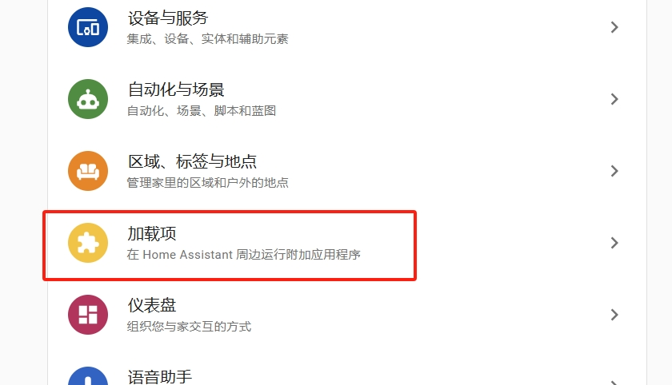
- 点击右下角的 "ADD-ON STORE"或"加载项商店"
  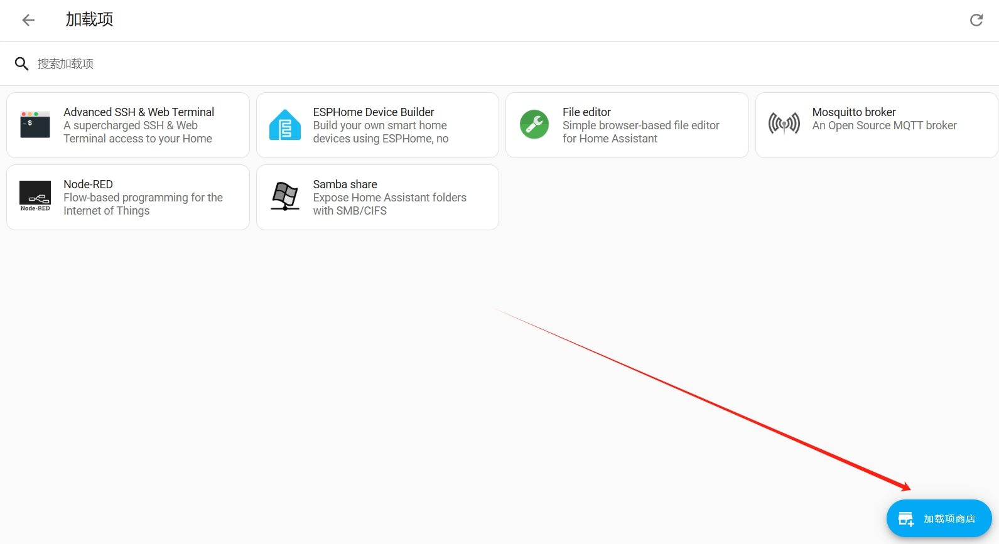
- 点击右上角的三个点菜单
- 选择 "Repositories"或"仓库"
  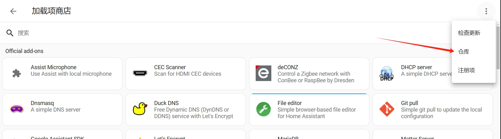
- 在弹出的对话框中输入sgcc electricity new存储库地址
- 地址：https://github.com/ARC-MX/sgcc_electricity_new
- 推荐使用国内源：[https://gitee.com/ARC-MX/sgcc_electricity_new](https://gitee.com/ARC-MX/sgcc_electricity_new)
- 点击 "ADD" 或 "添加" 确认添加
  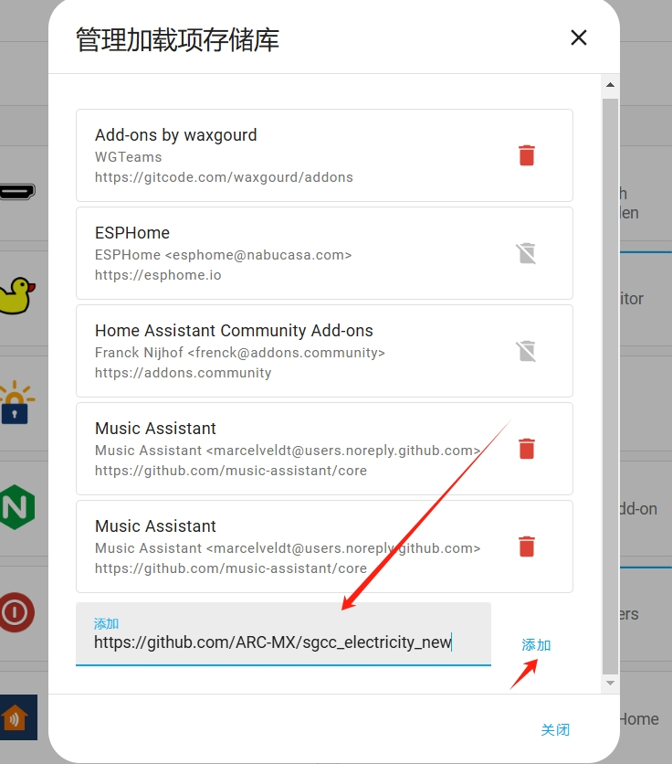

### 2. 安装 Add-on

- 点击右上角的三个点菜单
- 选择 "Refresh" 或 "检查更新"
  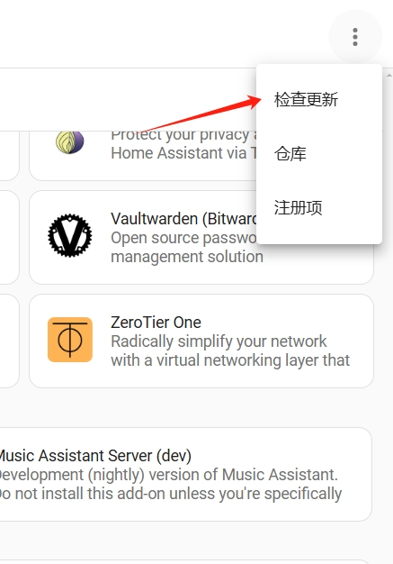
- 在列表中找到新添加的第三方 Add-on
  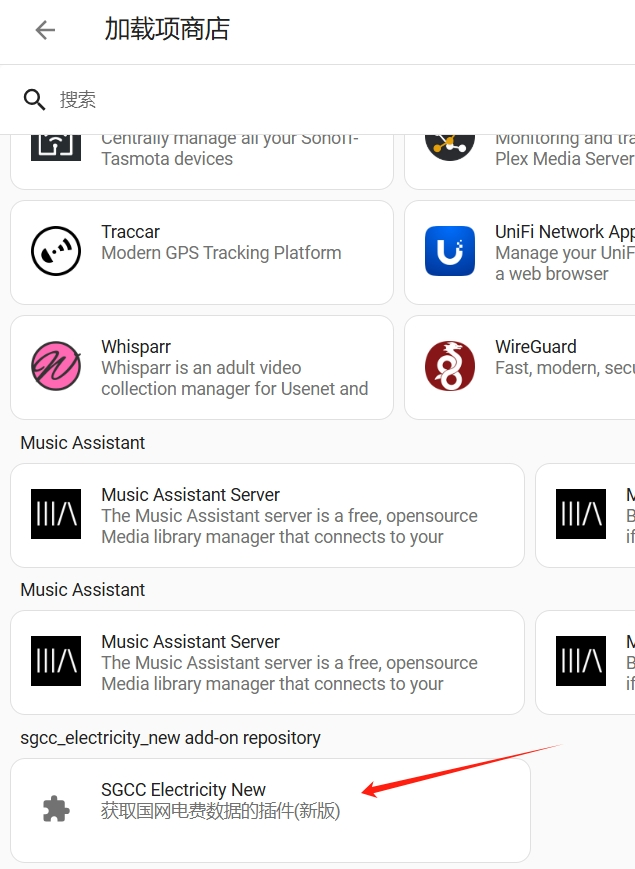
- 点击想要安装的 Add-on
- 点击 "INSTALL" 或 "安装" 开始安装
  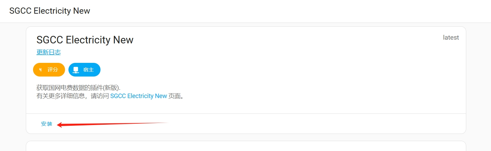
- 等待安装完成
  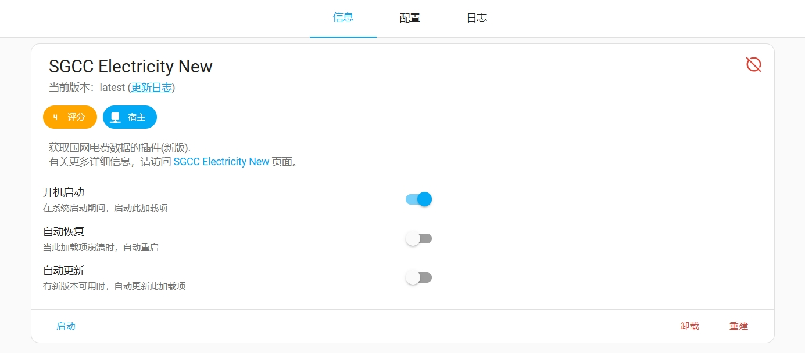

### 3. 配置和启动

- 安装完成后，点击 "CONFIGURATION" 或 "配置" 标签
- 根据需要修改配置参数
  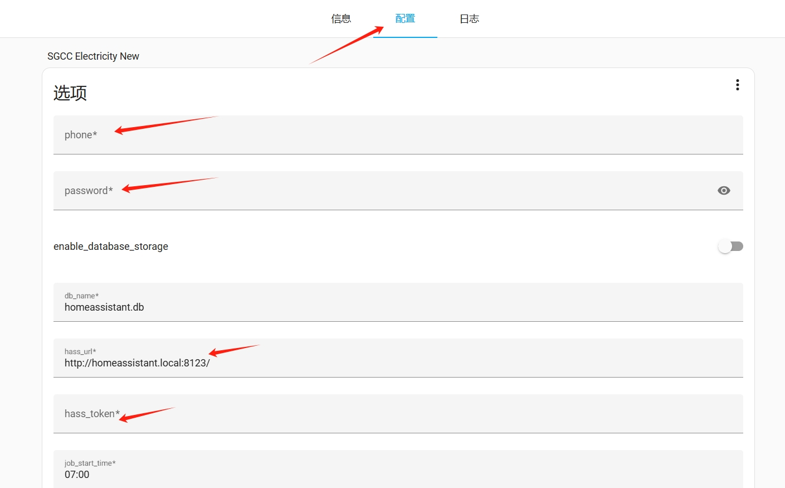
- 点击显示未使用的可选配置选项按钮，可以配置ignore_user_id等可选参数
  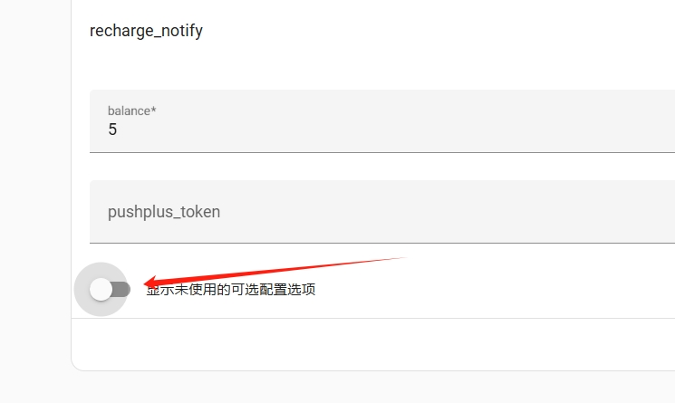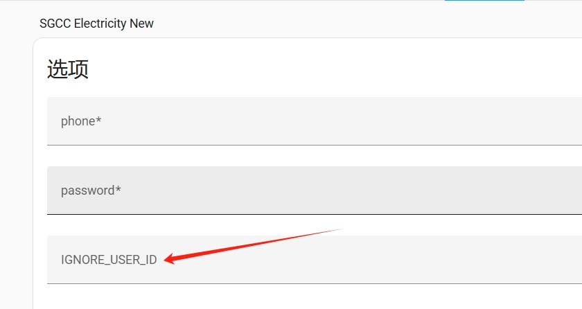
- 点击 "SAVE" 或 "保存" 保存配置
- 返回 "Info" 或 "信息" 标签页
- 点击 "START" 或 "启动" 启动 Add-on
  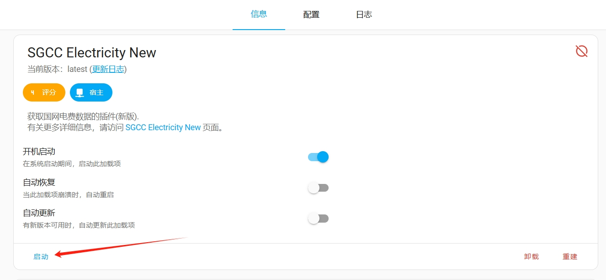
- 启动后，点击 "日志" 标签页，可以看到Add-on的运行状态
  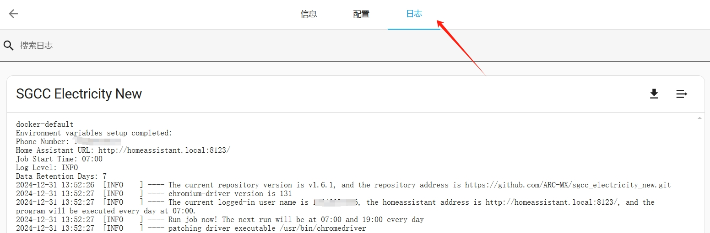

## 常见问题

- 如果无法找到新添加的 Add-on，请尝试刷新页面
- 如果安装失败，检查存储库地址是否正确
- 遇到问题可以查看 "日志" 标签页的日志信息
